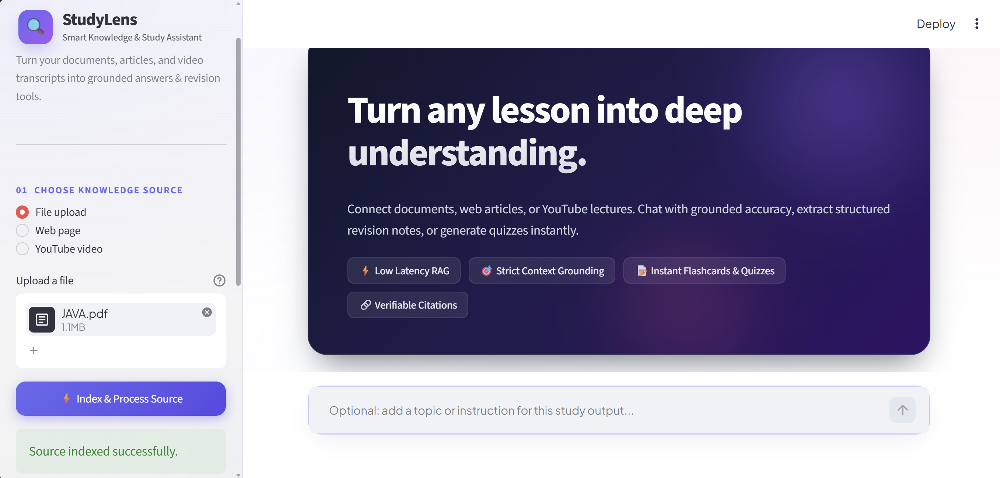
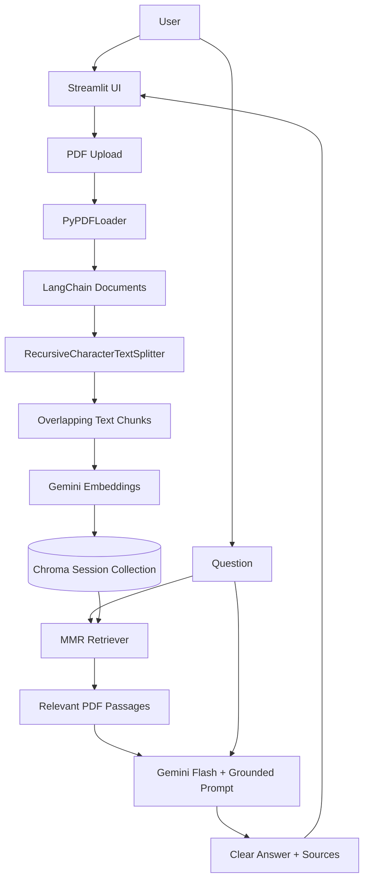

# Study RAG

Study RAG is a multi-source, document-grounded learning assistant built with Streamlit, LangChain, ChromaDB, and Google Gemini.

It indexes user-provided files, public webpages, or YouTube transcripts; retrieves relevant passages for a request; and generates answers or study material using only those passages.

This project was built to understand the complete Retrieval-Augmented Generation (RAG) workflow—from multi-source ingestion and vector embeddings to grounded answer generation.

## Overview

The application follows this RAG flow:

1. A user selects a supported file, webpage URL, or YouTube URL.
2. The source is loaded into LangChain document objects.
3. Pages are split into overlapping text chunks.
4. Gemini creates vector embeddings for each chunk.
5. The vectors are placed in a Chroma collection for the current session.
6. The user asks a question or selects a study output.
7. MMR retrieval finds relevant and diverse passages.
8. The retrieved passages are supplied to a constrained Gemini prompt.
9. Gemini Flash returns a clear, context-grounded answer.
10. The user can inspect the source passages and their page, slide, URL, or timestamp label.

## Core Features

- File uploads: PDF, DOCX, PPTX, TXT, CSV, and Markdown
- Public webpage URL ingestion
- YouTube transcript ingestion for public videos with available captions
- PDF text extraction with `PyPDFLoader`
- Recursive chunking with overlap
- Gemini embedding generation using `gemini-embedding-001`
- ChromaDB vector search
- Maximal Marginal Relevance (MMR) retrieval
- Gemini Flash answer generation
- Context-only answering to reduce hallucinations
- Clean Streamlit conversational interface
- Readable answers without Gemini metadata/signatures
- Light and dark mode friendly interface
- Expandable source passage and page-number display
- Session-based chat history
- Friendly handling for API quota errors
- Original command-line RAG demo retained separately

## Screenshots

### Source selection



The following screenshots can be added as the remaining flows are captured:

```text
assets/rag-answer.png    # Grounded answer with expanded sources
assets/study-mode.png    # Notes, flashcards, or MCQ output
assets/youtube-rag.png   # Optional: YouTube timestamp citation
```

Use only successful, clean screens. Do not include API keys, quota errors, or private document content.

## Architecture



## RAG Pipeline

```text
Uploaded PDF
    |
    v
PyPDFLoader
    |
    v
LangChain Documents
    |
    v
Recursive Character Splitter
    |
    v
Text Chunks
    |
    v
Gemini Embeddings
    |
    v
Chroma Vector Store
    |
    v
User Question
    |
    v
MMR Retrieval
    |
    v
Relevant Chunks
    |
    v
Grounded Prompt + Gemini Flash
    |
    v
Final Answer and Source Passages
```

## Directory Structure

```text
RAG/
├── frontend/
│   └── app.py             # Streamlit app for multi-source RAG learning
├── backend/
│   ├── main.py            # Original command-line RAG demonstration
│   ├── rag_sources.py     # File, webpage, and YouTube source loaders
│   ├── create_chroma.py   # Builds an example persistent ChromaDB
│   ├── embedding.py       # Gemini embedding-model test script
│   ├── document_loaders/
│   │   └── JAVA.pdf       # Example PDF for the command-line demo
│   └── chroma_db/         # Example persistent Chroma database
├── .env                   # Local API key configuration (not committed)
└── README.md
```

### `frontend/app.py`

The Streamlit application layer. It is responsible for:

- Uploading files or indexing webpage and YouTube URLs
- Loading pages and splitting them into chunks
- Creating a Chroma collection for the active browser session
- Maintaining chat history in Streamlit session state
- Retrieving context with MMR
- Extracting clean answer text from Gemini responses
- Showing source passages with page, slide, URL, or timestamp labels
- Displaying helpful errors when the embedding quota is exhausted
- Applying UI styling that remains readable in light and dark mode

### `backend/main.py`

The original command-line RAG implementation. It:

- Loads the existing `chroma_db` database
- Uses the same Gemini embedding model used during indexing
- Retrieves four relevant chunks using MMR
- Builds a context-restricted prompt
- Sends the prompt to Gemini Flash
- Prints the answer in the terminal

`main.py` is intentionally kept separate from the Streamlit interface.

### `backend/create_chroma.py`

Creates the example persistent ChromaDB used by the command-line demo. It loads `document_loaders/JAVA.pdf`, splits the content into chunks, embeds the chunks, and stores them in `chroma_db/`.

### `backend/embedding.py`

A small standalone script for testing Gemini embedding generation.

## Tech Stack

| Layer | Technology | Purpose |
| --- | --- | --- |
| User interface | Streamlit | PDF upload, chat interaction, and source display |
| RAG framework | LangChain | Document loading, splitting, retrieval, and model integration |
| LLM | Google Gemini Flash | Context-grounded answer generation |
| Embeddings | `gemini-embedding-001` | Semantic vector representation of PDF chunks |
| Vector database | ChromaDB | Storage and similarity retrieval of embeddings |
| PDF processing | PyPDFLoader | PDF page extraction |
| Text chunking | RecursiveCharacterTextSplitter | Chunk creation with contextual overlap |
| Configuration | python-dotenv | Loading `GOOGLE_API_KEY` from `.env` |
| Language | Python | Application implementation |

## Retrieval Configuration

The Streamlit app uses Maximal Marginal Relevance (MMR) retrieval:

```text
Returned passages (k): 4
Candidate passages (fetch_k): 10
Chunk size: 1000 characters
Chunk overlap: 200 characters
```

MMR is used to retrieve passages that are relevant to the question while reducing unnecessary repetition between retrieved chunks.

## Grounding Strategy

The answer prompt is deliberately limited to retrieved PDF context. The model is instructed to:

- Answer only with information found in the supplied passages
- Avoid inventing details
- Keep the answer clear and concise
- Use bullets only when they improve readability
- Return `I could not find the answer in the PDF.` when the document does not contain the answer

This separates retrieval from generation and gives the user a way to inspect the evidence behind each answer.

## Environment Setup

Create a `.env` file in the project root:

```env
GOOGLE_API_KEY=your_google_gemini_api_key
```

Never commit `.env` to GitHub or share the API key publicly.

## Installation

Clone your repository:

```bash
git clone <your-repository-url>
cd RAG
```

Create a virtual environment:

```bash
python -m venv .venv
```

Activate it on Windows:

```powershell
.\.venv\Scripts\Activate.ps1
```

Activate it on Linux or macOS:

```bash
source .venv/bin/activate
```

Install the required packages:

```bash
pip install streamlit langchain langchain-community langchain-chroma langchain-google-genai langchain-text-splitters pypdf python-dotenv
```

## Running the Streamlit Application

Start the multi-source RAG learning assistant:

```powershell
streamlit run frontend/app.py
```

Open the local URL shown in the terminal, index a source from the sidebar, and start learning from it.

## Using the Application

1. Start the Streamlit app.
2. Choose a file upload, webpage URL, or YouTube video from the sidebar.
3. Wait for the document to be indexed.
4. Enter a question in the chat input.
5. Read the generated answer.
6. Open **Sources used for this answer** to review the retrieved text and page numbers.
7. Use **Clear conversation** before beginning a new discussion about the same PDF.
8. Index a new source to replace the active source for the session.

## Command-Line Testing

The original backend can also be tested independently:

```powershell
python backend/main.py
```

It uses the pre-built `backend/chroma_db/` generated from `backend/document_loaders/JAVA.pdf`.

To rebuild that example database, run:

```powershell
python backend/create_chroma.py
```

## Error Handling

If the app shows `RESOURCE_EXHAUSTED` or error `429`, Google’s embedding API quota is temporarily unavailable. The source is not necessarily invalid.

Wait for quota to become available, then select **Index source** again. The interface does not automatically retry, so it avoids consuming additional requests unnecessarily.

## Design Decisions

### Why RAG?

The app needs to answer questions about a user’s uploaded PDF, not rely only on an LLM’s general training knowledge. Retrieval supplies relevant document context before the model writes an answer.

### Why vector embeddings?

Embeddings enable semantic search. This allows the system to find relevant content even when the question uses different wording from the PDF.

### Why chunk overlap?

Content often continues across chunk boundaries. A 200-character overlap helps preserve nearby context when a section is split.

### Why show source passages?

Showing the passages makes the result easier to verify and helps diagnose whether a poor answer came from retrieval, missing document content, or generation.

### Why session-only indexing for uploads?

The current Streamlit app creates an isolated collection for the active user session. This prevents an uploaded PDF from replacing the command-line example database. Persistent multi-user document management is a future improvement.

## Current Limitations

- Supported uploads are PDF, DOCX, PPTX, TXT, CSV, and Markdown
- One active source per browser session
- No authentication or user accounts
- No persistent library of uploaded documents
- No multi-user document isolation beyond the active session
- No hybrid keyword and vector search
- No reranking model
- No automated retrieval or faithfulness evaluation
- No background queue for large-document processing
- API usage is subject to Google Gemini quotas
- No dedicated production API layer

## Future Improvements

- Video summarizer integration
- Video transcript ingestion for RAG question-answering
- DOCX, PPTX, TXT, CSV, and Markdown support
- Multiple-document workspaces
- Configurable retrieval controls in the interface
- Citation-style source links in answers
- Hybrid search and reranking
- Answer-quality evaluation
- User authentication and per-user document collections
- Background ingestion for large files
- FastAPI backend
- Docker deployment and CI/CD

## Project Status

Study RAG is a functional learning-oriented RAG prototype. The complete multi-source pipeline is implemented:

```text
Upload PDF
    ↓
Load and chunk text
    ↓
Create embeddings
    ↓
Store vectors in Chroma
    ↓
Retrieve relevant passages
    ↓
Generate a grounded answer
    ↓
Show answer and sources
```

The next stage is to extend the project with video summarization and production-oriented retrieval, security, evaluation, and deployment capabilities.

## License

This project is licensed under the [MIT License](LICENSE).

## Author

Built as a practical project for learning document ingestion, semantic retrieval, vector databases, and context-grounded LLM generation.
